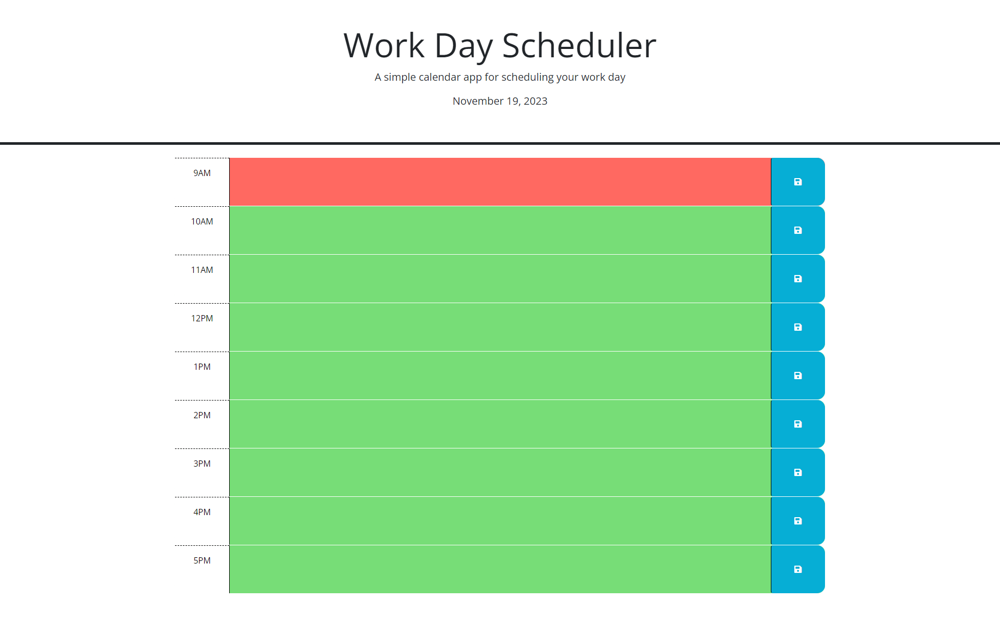

# Work Day Scheduler
## Description

The work day scheduler was created in an effort to utilize various third party APIs in a single project. The featured APIs used here were jQuery, Bootstrap, and Dayjs. The primary challenge faced when creating this project was dynamically generating the work day scheduler time blocks so that this project could be more easily manipulated. Connecting this with local storage and having that data accurately saved and displayed was also a challenge. The end result is a product that allows the user to create and store a simple work day plan that can be edited and modified to adjust to the user's needs by changing simple variables in the code.

## Usage

This project is live and can be accessed at the following link: https://honeybuzz94.github.io/js-coding-quiz/

Anyone is welcome to use or duplicate this project as they would like.

## Credits

Collaborators:

* Sachin Jhaveri (EdX tutor) helped optimize JS code

The following resources were used to assist with the development of this project:

* The [jQuery](https://jquery.com/), Bootstrap, and Dayjs APIs were used for this project.

---